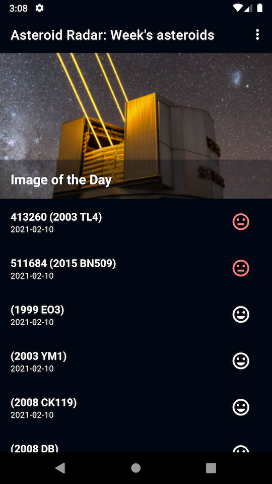
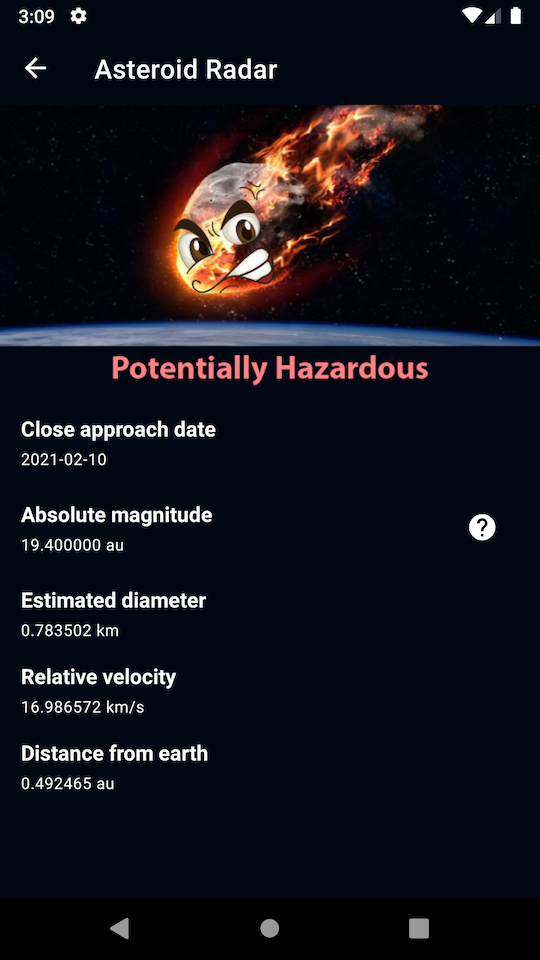
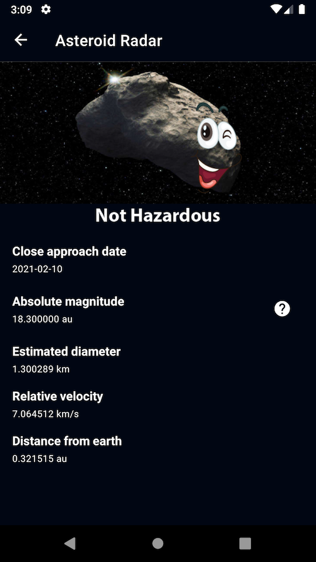
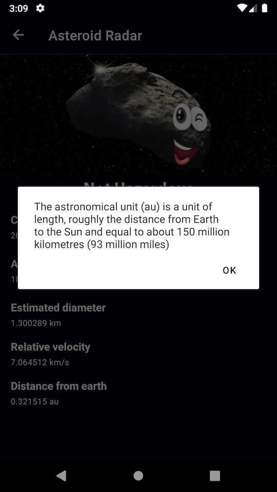

# Asteroid Radar app

This is an application to view the asteroids detected by NASA that pass near Earth. The user of the app can view all the detected asteroids given a period of time with data such as the size, velocity, distance to earth and if they are potentially hazardous.

The application can run in online and offline mode, it uses MVVM architecture and technologies such as Retrofit (to integrate with the Internet) and Room Persistence Library to save data in offline cache as well as Work Manager to periodically refresh data in the background.

 
  

# Before Runninig

In order to run application you need to get your own API key for application from https://api.nasa.gov and then place it inside **apikey.properties** file as follows

```properties
API_KEY="<YOUR API KEY GOES HERE>"
```

# Technologies Used

This application is 100% Kotlin based and demonstrates the use of the following technologies:
* [Material Design Component Library](https://material.io/develop/android) for building UI aligned with material design guidelines
* [DataBinding](https://developer.android.com/topic/libraries/data-binding) for defining layouts in declarative format
* [Navigation Component](https://developer.android.com/guide/navigation/navigation-getting-started) for navigation
* [Hilt](https://developer.android.com/training/dependency-injection/hilt-android) for Dependency Injection
* [Coroutines](https://developer.android.com/kotlin/coroutines) for making async calls to APIs and Database
* [Room](https://developer.android.com/training/data-storage/room) for working with data stored in the Database
* [Retrofit](https://square.github.io/retrofit/) for data retrieval
* [Picasso](https://github.com/square/picasso) for loading thumbnails
* [WorkManager](https://developer.android.com/topic/libraries/architecture/workmanager) to schedule background services


